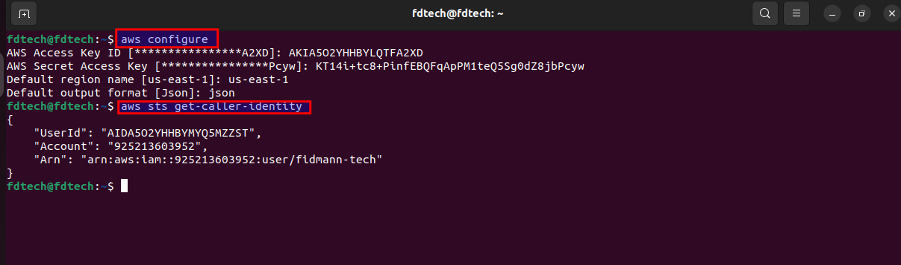
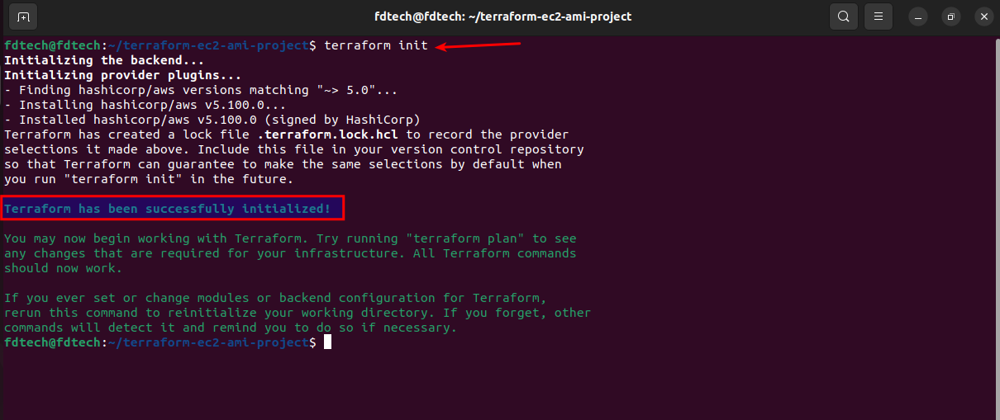
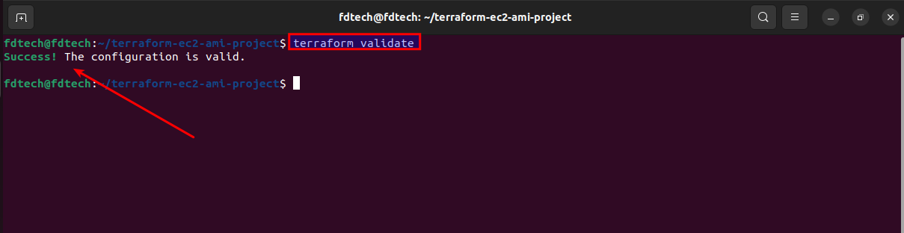
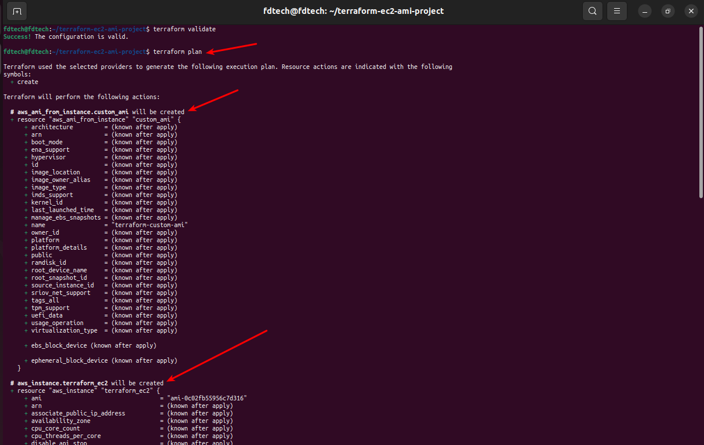
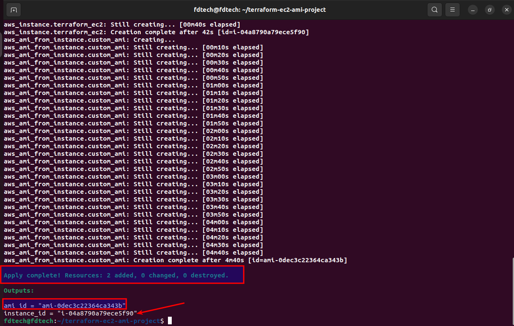
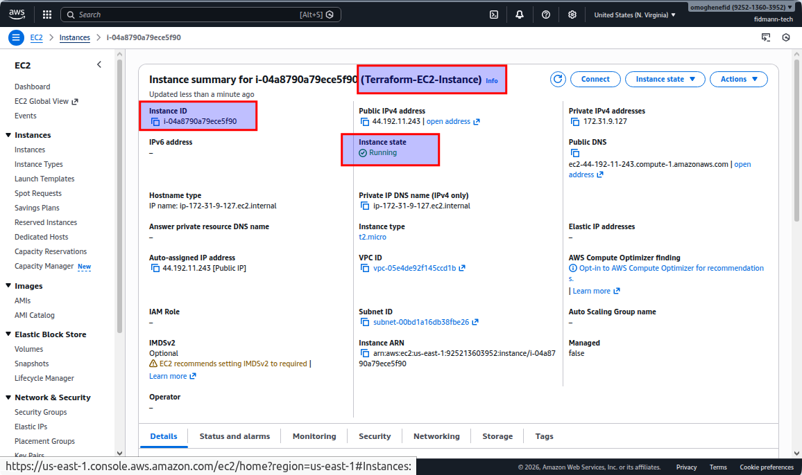
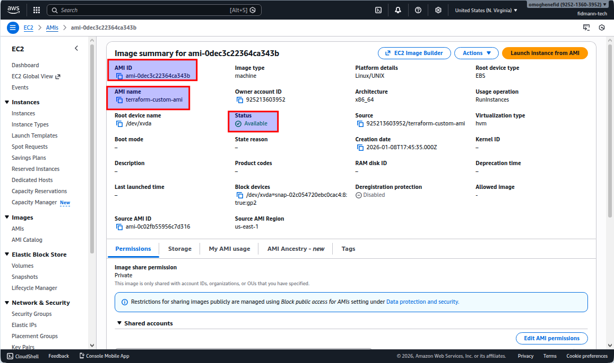
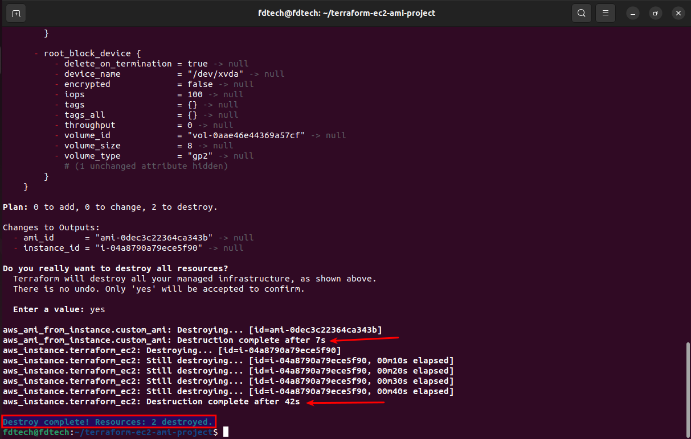

# Terraform EC2 Instance and AMI Creation

## 📌 Project Overview
This project demonstrates how to use **Terraform** to automate the creation of an **EC2 instance on AWS** and generate a **custom Amazon Machine Image (AMI)** from that instance.

The project follows **Infrastructure as Code (IaC)** best practices and showcases Terraform fundamentals used in real-world DevOps workflows.

---

## 🎯 Objectives
- Write basic Terraform configuration files
- Automate EC2 instance creation on AWS
- Create a reusable AMI from an EC2 instance using Terraform
- Gain hands-on experience with Terraform lifecycle commands

---

## 🛠️ Prerequisites
Before starting this project, ensure you have the following:

- An active AWS Account
- AWS CLI installed and configured
- Terraform installed on your local machine
- IAM user with sufficient permissions for EC2 and AMI operations

---

## 📂 Project Structure

```bash
terraform-ec2-ami-project/
├── main.tf
├── provider.tf
├── variables.tf
├── outputs.tf
├── README.md
└── img/
```

## 📄 Terraform Configuration Files

main.tf – Defines the EC2 instance and AMI resources

provider.tf – Configures the AWS provider and required versions

variables.tf – Declares reusable input variables

outputs.tf – Exposes key resource identifiers

## 🚀 Implementation Steps
### 1️⃣ Verify AWS CLI Configuration

Ensure that your AWS CLI is correctly configured and authenticated.

aws sts get-caller-identity


Capture the terminal output showing Account, UserId, and ARN.

### 2️⃣ Initialize Terraform

Initialize the Terraform working directory.

terraform init


Capture the message: Terraform has been successfully initialized.

### 3️⃣ Review Terraform Execution Plan

Preview the infrastructure changes Terraform will apply.

terraform plan


Capture the planned creation of the EC2 instance and AMI.

### 4️⃣ Apply Terraform Configuration

Provision the EC2 instance and create the AMI.

terraform apply
Type yes when prompted.


### 5️⃣ Verify Resources in AWS Console
✅ EC2 Instance

Navigate to AWS Console → EC2 → Instances

Confirm the instance status is Running


✅ Amazon Machine Image (AMI)

Navigate to EC2 → AMIs

Confirm the AMI status is Available


Capture AMI name and availability status.

### 6️⃣ Cleanup Resources 

Destroy all provisioned resources to avoid unnecessary AWS charges.

terraform destroy


## 📤 Outputs

The following outputs are generated after successful execution:

EC2 Instance ID

Custom AMI ID

✅ Key Learnings

## Terraform resource lifecycle management

Infrastructure automation using Infrastructure as Code (IaC)

Dependency handling using depends_on

AWS EC2 instance provisioning

AMI creation and reuse

## 🏁 Conclusion

This project provides a solid foundation for using Terraform with AWS. It mirrors real-world DevOps workflows, reinforces Infrastructure as Code best practices, and is suitable for inclusion in a professional DevOps portfolio.

## Below are screenshots of workflow:









